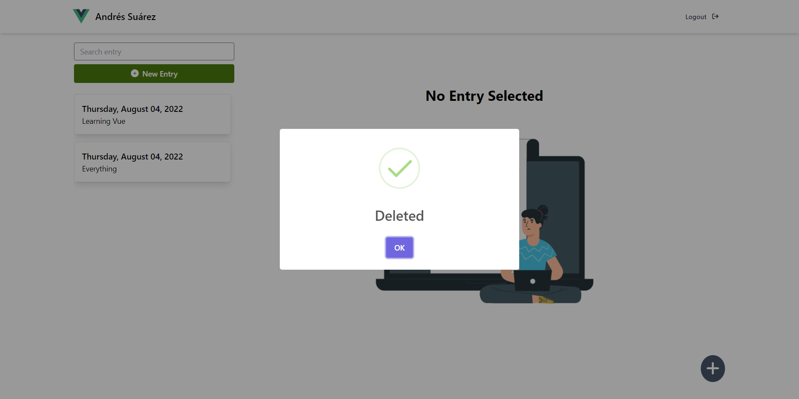

# Journal-Vue
This application is a journal where the user logged in can create, update and delete the entries.

### Functionality
- Navigate through the two modules of the app (Authentication and Daybook)
- Send requests to firebase to update the data from the app
- Vuex to manage the app state
- Options API use to create the module of Daybook, Composition API to create the other one
- AuthGuard to keep daybook module off limits if the user is not logged in

## Installation
To install this project follow the next steps:
1. Download the repository found here: [Journal-Vue](https://github.com/SuaferoanTJK/Journal-Vue).
2. In the project folder create an .env file with the following variables: VUE_APP_AUTH_API_KEY, VUE_APP_FIREBASE_RTDB_NAME, VUE_APP_CLOUDINARY_NAME, VUE_APP_CLOUDINARY_API_KEY, VUE_APP_CLOUDINARY_API_SECRET
3. Create a new project in Firebase with the name you desire and follow steps 4, 5 and 6
4. Create a realtime database where the write and edit rules have this condition: "auth != null".
5. In the authentication options of the project enable the email/password sign-in method.
6. Go to the project settings and take note from the Web Api Key and Project ID and assign them to VUE_APP_AUTH_API_KEY and VUE_APP_FIREBASE_RTDB_NAME
7. Create a cloudinary account [here](https://cloudinary.com).
8. Take note of the Cloud Name, the API Key and the API Secret and assign them to VUE_APP_CLOUDINARY_NAME, VUE_APP_CLOUDINARY_API_KEY, VUE_APP_CLOUDINARY_API_SECRET
9. Run "**npm install**" script.
10. Run "**yarn serve**" script.
11. Go to http://localhost:8080
12. (Optional and it may need adjustment according to your choices) If you want to run the test run "**yarn test:unit**" script.

## Screenshots

  
  
  
  
  
  
  
  
  
  
  
  
  

## Get in touch
### LinkedIn
https://www.linkedin.com/in/andrés-f-suárez/
